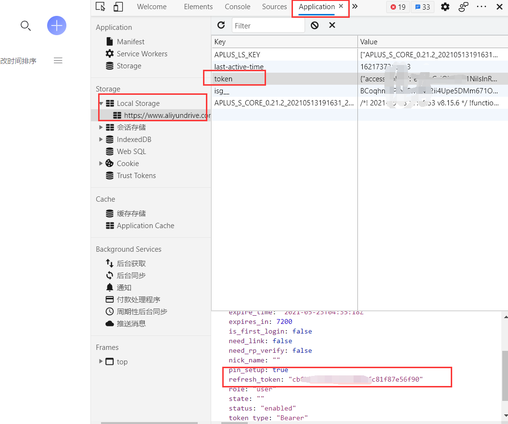
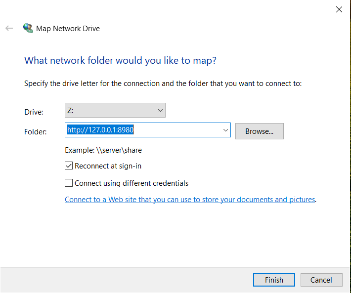

# 阿里云盘作为本地磁盘使用


## 获取阿里云盘refresh_token过程

1. 先通过浏览器（建议chrome）打开阿里云盘官网并登录：阿里云盘
2. 登录成功后，按F12打开开发者工具，点击Application，点击Local Storage，点击 Local Storage下的 阿里云盘 - 公测进行中·阿里巴巴集团出品，点击右边的token，此时可以看到里面的数据，其中就有refresh_token，把其值复制出来即可。（格式为小写字母和数字，不要复制双引号。例子：ca6bf2175d73as2188efg81f87e55f11）
第二步有点繁琐，大家结合下面的截图就看懂了



## 将阿里云盘转换为Webadv过程
Github 项目地址为https://github.com/zxbu/webdav-aliyundriver

### 容器运行

```
docker run -d --name=aliyundrive-webdav \
--restart=unless-stopped \
-p 18080:8080 \
-v /etc/aliyundrive-webdav/:/etc/aliyundrive-webdav/ \
-e REFRESH_TOKEN='abe8c19b19be4c99b0a8aa05466708f0' \
-e WEBDAV_AUTH_USER=admin \
-e WEBDAV_AUTH_PASSWORD=admin \
messense/aliyundrive-webdav
```

## 挂载到本地

我的电脑-》右键-》映射网络驱动器-》输入http://127.0.0.1:18080


大功告成！！！