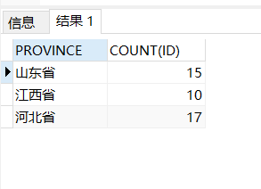
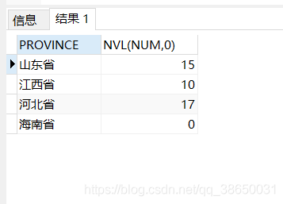

## PG官方文档

1. [《PostgreSQL中文文档》](www.postgres.cn/docs)
2. [《PostgreSQL英文文档》](www.postgres.org/docs)
   
## PG表分区

1. 创建主表

`create table tbl_user (id int, info text, logdate timestamp not null) PARTITION BY RANGE (logdate);`

2. 创建分区表(分别为2020和2021)

`CREATE TABLE tbl_user_2020 PARTITION OF tbl_user FOR VALUES FROM ('2020-01-01 00:00:00') TO ('2021-01-01 00:00:00');`

`CREATE TABLE tbl_user_2021 PARTITION OF tbl_user FOR VALUES FROM ('2021-01-01 00:00:00') TO ('2022-01-01 00:00:00');`

`ALTER TABLE public.tbl_user OWNER TO postgres;`

* 注意:分区时间包含关系为[startTime,endTime)

3. 创建序列
 ```
 CREATE SEQUENCE public.tbl_user_seq
    INCREMENT 1
    START 1
    NO MINVALUE
    NO MAXVALUE
    CACHE 2;

  ALTER SEQUENCE public.tbl_user_seq OWNER TO postgres;

```

4. 为主键设置sequence

` alter table public.tbl_user alter column id set default nextval('public.tbl_user_seq');`

5. 插入数据

`insert into tbl_user (info,logdate) values('随便写点什么1','2021-02-01 00:00:00');`

### Mysql转PG
1. LONGTEXT-TEXT
2. Int(11)-INTEGER
3. DOUBLE(21)-DOUBLE PRECISION
  'CURRENT_TIMESTAMP'-CURRENT_TIMESTAMP

#### PG查询表行数

```
SELECT relname AS TABLE_NAME,
		 reltuples AS rowCounts
FROM pg_class
WHERE relkind = 'r'
		AND relnamespace = 
    (SELECT oid
    FROM pg_namespace
    WHERE nspname='public')
ORDER BY  rowCounts desc; 
```

### 创建用户并授权
 
* 创建用户和密码

 `create  user usera  with password '123456';`

* 授予该用户连接权限

 `GRANT CONNECT ON DATABASE psrapi TO usera;`

* 授予该用户某个schema使用权

`GRANT USAGE ON SCHEMA public TO usera;`

* 授予该用户所有表的增删改查权限

`GRANT SELECT,update,INSERT,delete ON ALL TABLES IN SCHEMA public TO usera;`

* 新建表查询权限
  
`ALTER DEFAULT PRIVILEGES IN SCHEMA public GRANT select ON TABLES TO usera;`

* 删除所有的用户权限
  
`revoke all on database databasename from usera;`

`revoke all on schema public from usera;`

`revoke all on all tables in schema public from "psrreader@psrstreamdata";`

`ALTER DEFAULT PRIVILEGES IN SCHEMA public REVOKE ALL ON TABLES FROM "psrreader@psrstreamdata";`

* 删除用户
  
`Drop user usera;`

### 查看用户系统权限和对象权限

1. 查看某用户的系统权限

`SELECT * FROM pg_roles WHERE rolname='postgres';`

2. 查看某用户的表权限

`select * from information_schema.table_privileges where grantee='postgres';`

3. 查看某用户的usage权限

`select * from information_schema.usage_privileges where grantee='postgres';`

4. 查看某用户在存储过程函数的执行权限

`select * from information_schema.routine_privileges where grantee='postgres';`

5. 查看某用户在某表的列上的权限

`select * from information_schema.column_privileges where grantee='postgres';`

6. 查看当前用户能够访问的数据类型

`select * from information_schema.data_type_privileges ;`

7. 查看用户自定义类型上授予的USAGE权限

`select * from information_schema.udt_privileges where grantee='postgres';`

8. 批量修改所有者owner
```
select
	'alter table ' || nsp.nspname || '.' || cls.relname || ' owner to usera;' || chr (13)
from
	pg_catalog.pg_class cls,
	pg_catalog.pg_namespace nsp
where
	nsp.nspname in ('public')
	and cls.relnamespace = nsp.oid
	and cls.relkind = 'r'
order by
	nsp.nspname,
	cls.relname;

```
### PG杀死锁表进程

```sql
select * from pg_stat_activity;
select pg_cancel_backend(28683);
select pg_terminate_backend(28683);
```
### GROUP BY 如果为空值显示为0
```sql
SELECT PROVINCE, count(id) 
FROM GUTAN_POLICY 
Where 
(GAS_SOURCE = '稻田甲烷' or GAS_SOURCE LIKE '%,稻田甲烷' or GAS_SOURCE LIKE '%稻田甲烷,%' or GAS_SOURCE LIKE '%稻田甲烷,%') 
GROUP BY PROVINCE

```


修改后
```sql
select A.PROVINCE,COALESCE(num,0)
from (
SELECT DISTINCT PROVINCE  FROM GUTAN_POLICY
)A
LEFT JOIN 
(
select PROVINCE ,count(ID) as num from GUTAN_POLICY
	where  (GAS_SOURCE = '稻田甲烷' or GAS_SOURCE LIKE '%,稻田甲烷' or GAS_SOURCE LIKE '%稻田甲烷,%' or GAS_SOURCE LIKE '%稻田甲烷,%')
	group by PROVINCE
) B
on A.PROVINCE=B.PROVINCE

```


1.  新建存储过程自动建表

```sql
create or replace function addId() returns 
boolean AS
$BODY$
declare ii integer;
  begin
  ii := 1;
  FOR ii IN 1..1000000 LOOP
  INSERT INTO test01 (id) VALUES (ii);
  end LOOP;
  return true;
  end;
$BODY$
LANGUAGE plpgsql;

select * from addId();
```

### PG 求交并差集

INTERSECT用于求交集，UNION/UNION ALL用于求并集，EXCEPT用于求差集。

用法如下：

query1 INTERSECT query2

query1 UNION query2 

query1 EXCEPT query2

 其中query1和query2的SELECT子句中字段个数必须相同，且对应的数据类型必须相同（如果int和bigint结果取bigint,varchar(5)和varchar(10)结果取varchar(10)），字段名可以不同，但是最终结果会以第一个SELECT子句中字段名称返回。

1. INTERSECT
两个查询使用INTERSECT求交集的结果使用图片表示如下：


2. UNION / UNION ALL
两个查询使用UNION的结果使用图片表示如下：


注意： UNION默认会去重，即重复数据只会返回一行，

UNION ALL会保留重复数据，返回所有行。

3. EXCEPT
两个查询使用EXCEPT(A EXCEPT B)求差集的结果：


### PG无法删除某个数据库

删除数据库时报错：
`ERROR: database "psrPg" is being accessed by other users DETAIL: There are 2 other sessions using the database.`
解决方式：
断开连接到这个数据库上的所有链接，再删除数据库。怎么断开呢？在PostgreSQL 9.2 及以上版本，执行下面的语句：

```
SELECT pg_terminate_backend(pg_stat_activity.pid)
FROM pg_stat_activity
WHERE datname='mydb' AND pid<>pg_backend_pid();

drop DATABASE mydb;

```
语句说明：

pg_terminate_backend：用来终止与数据库的连接的进程id的函数。
pg_stat_activity：是一个系统表，用于存储服务进程的属性和状态。
pg_backend_pid()：是一个系统函数，获取附加到当前会话的服务器进程的ID。

### JSON和JSONB的操作符

| 操作符	 | 右操作数类型	 | 描述	                  | 示例	                                                        | 结果           |
|------|---------|----------------------|------------------------------------------------------------|--------------|
| ->   | 	int	   | 获取JSON数组元素（索引从0开始）   | 	select '[{"a":"foo"},{"b":"bar"},{"c":"baz"}]'::json->2;	 | {"c":"baz"}  |
| ->   | 	text   | 	通过键获取值	             | select '{"a": {"b":"foo"}}'::json->'a';	                   | {"b":"foo"}  |
| ->>  | 	int    | 获取JSON数组元素为 text     | select '[1,2,3]'::json->>2;                                | 	3           |
| ->>  | 	text   | 	通过键获取值为text	        | select '{"a":1,"b":2}'::json->>'b';	                       | 2            |
| #>	  | text[]  | 在指定的路径获取JSON对象       | select '{"a": {"b":{"c": "foo"}}}'::json#>'{a,b}';	        | {"c": "foo"} |
| #>>  | 	text[] | 在指定的路径获取JSON对象为 text | select '{"a":[1,2,3],"b":[4,5,6]}'::json#>>'{a,2}';	       | 3            |

### JSONB额外操作符

| 操作符	          | 右操作数类型	  | 描述	                                                        | 示例	                                                                                                          | 结果                   |
|---------------|----------|------------------------------------------------------------|--------------------------------------------------------------------------------------------------------------|----------------------|
| @>            | 	jsonb   | 	左侧json最上层的值是否包含右边json对象                                   | select '{"a":{"b":2}}'::jsonb @> '{"b":2}'::jsonb;  <br/>select '{"a":1, "b":2}'::jsonb @> '{"b":2}'::jsonb; | f  <br/>t            |
| <@	           | jsonb	   | 左侧json对象是否包含于右侧json最上层的值内                                  | 	select '{"b":2}'::jsonb <@ '{"a":1, "b":2}'::jsonb;	                                                        | t                    |
| ?	            | text	    | text是否作为左侧Json对象最上层的键	                                     | select '{"a":1, "b":2}'::jsonb ? 'b';	                                                                       | t                    |
| ?&#124;       | 	text[]	 | text[]中的任一元素是否作为左侧Json对象最上层的键	                             | select '{"a":1, "b":2, "c":3}'::jsonb ?&#124; array['b', 'c'];	                                              | t                    |
| ?&            | 	text[]	 | text[]中的所有元素是否作为左侧Json对象最上层的键	                             | select '["a", "b"]'::jsonb ?& array['a', 'b'];	                                                              | t                    |
| &#124; &#124; | 	jsonb	  | 连接两个json对象，组成一个新的json对象	                                   | select '["a", "b"]'::jsonb &#124;&#124;     '["c", "d"]'::jsonb;	                                            | ["a", "b", "c", "d"] |
| -	            | text	    | 删除左侧json对象中键为text的键值对	                                     | select '{"a": "b"}'::jsonb - 'a';                                                                            | 	{}                  |
| -	            | integer  | 删除数组指定索引处的元素，如果索引值为负数，则从右边计算索引值。  <br/>如果最上层容器内不是数组，则抛出错误。 | select '["a", "b"]'::jsonb - 1;                                                                              | 	["a"]               |
| #-            | 	text[]  | 删除指定路径下的域或元素（如果是json数组，且整数值是负的，则索引值从右边算起）                  | select '["a", {"b":1}]'::jsonb #- '{1,b}';	                                                                  | ["a", {}]            |

### JSON创建函数

| 函数                                                                                     | 描述                                                                                      | 示例                                                                                                         | 结果                                    |
|----------------------------------------------------------------------------------------|-----------------------------------------------------------------------------------------|------------------------------------------------------------------------------------------------------------|---------------------------------------|
| to_json(anyelement)  <br/>to_jsonb(anyelement)                                         | 返回json或jsonb类型的值。数组和复合被转换（递归）成数组和对象。另外除数字、布尔、NULL值（直接使用NULL抛出错误）外，其他标量必须有类型转换。（此处请参考原文） | select to_json('3'::int);	                                                                                 | 3                                     |
| array_to_json(anyarray[, pretty_bool])                                                 | 以JSON数组返回该数组。PostgreSQL多维数组变成JSON数组中的数组。如果pretty_bool 为真，则在维度1元素之间添加换行。                 | select array_to_json('{{1,5},{99,100}}'::int[],true);                                                      | [[1,5], +[99,100]]                    |
| row_to_json(record [, pretty_bool])	                                                   | 以JSON对象返回行。如果pretty_bool 为真，则在级别1元素之间添加换行。	                                             | select row_to_json(row(1,'foo'),true);                                                                     | {"f1":1, +"f2":"foo"}                 |
| json_build_array(VARIADIC "any")  <br/>jsonb_build_array(VARIADIC "any")               | 建立一个由可变参数列表组成的不同类型的JSON数组	                                                              | select json_build_array(1,2,'3',4,5);                                                                      | 	[1, 2, "3", 4, 5]                    |
| json_build_object(VARIADIC "any")  <br/>jsonb_build_object(VARIADIC "any")             | 建立一个由可变参数列表组成的JSON对象。参数列表参数交替转换为键和值。	                                                   | select json_build_object('foo',1,'bar',2);                                                                 | 	{"foo" : 1, "bar" : 2}               |
| json_object(text[])  <br/>jsonb_object(text[])                                         | 根据text[]数组建立一个json对象，如果是一维数组，则必须有偶数个元素，元素交替组成键和值。如果是二维数组，则每个元素必须有2个元素，可以组成键值对。          | select json_object('{a, 1, b, "def", c, 3.5}');   <br/>select json_object('{{a, 1},{b, "def"},{c, 3.5}}'); | {"a" : "1", "b" : "def", "c" : "3.5"} |
| json_object(keys text[], values text[])  <br/>jsonb_object(keys text[], values text[]) | 分别从两组text[]中获取键和值，与一维数组类似。	                                                             | select json_object('{a, b}', '{1,2}');	                                                                    | {"a" : "1", "b" : "2"}                |

### JSON处理函数

此处不再赘述,详情在链接[PostgreSQL JSON Functions and Operators](https://www.postgresql.org/docs/14/functions-json.html)
