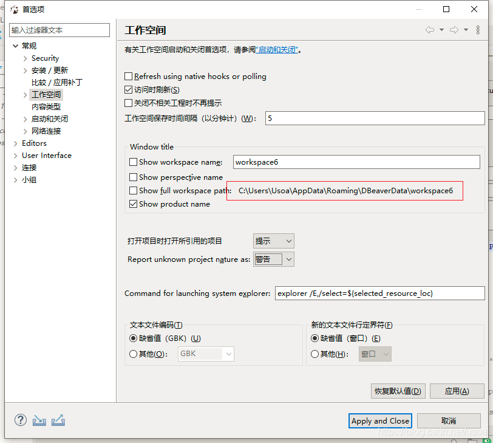

## 在DBeaver连接中保存的数据库密码，如果忘记了怎么办呢？如果是6.1.3以上的版本可以通过如下方法找回：

1. 找到workspace的位置，如下图红框位置：


2. 找到密码文件的位置，参考地址： `<workspace>\General\.dbeaver\credentials-config.json`

3. 使用openssl对credentials-config.json文件解码，我使用的是git bash

```
openssl aes-128-cbc -d \
  -K babb4a9f774ab853c96c2d653dfe544a \
  -iv 00000000000000000000000000000000 \
  -in credentials-config.json | \
  dd bs=1 skip=16 2>/dev/null
```
-K的参数值可以参看dbeaver源码：

https://github.com/dbeaver/dbeaver/blob/devel/plugins/org.jkiss.dbeaver.model/src/org/jkiss/dbeaver/model/impl/app/DefaultSecureStorage.java
