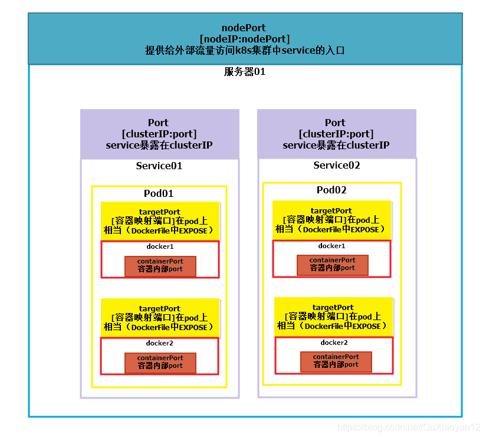

### port
port是k8s集群内部访问service的端口，即通过clusterIP: port可以访问到某个service

### nodePort
nodePort是外部访问k8s集群中service的端口，通过nodeIP: nodePort可以从外部访问到某个service。

### targetPort
targetPort是pod的端口，从port和nodePort来的流量经过kube-proxy流入到后端pod的targetPort上，最后进入容器。

### containerPort
containerPort是pod内部容器的端口，targetPort映射到containerPort。

